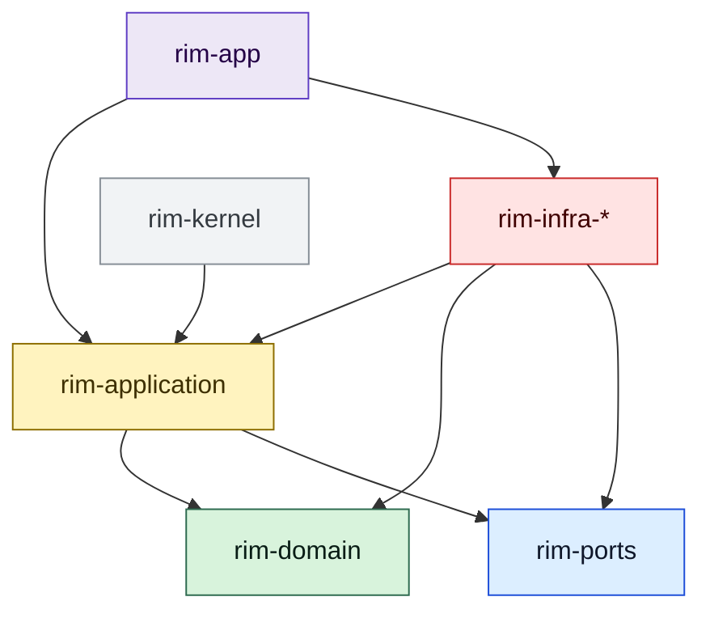

# ADR 0001: Layered Hexagonal Architecture

- Status: Accepted
- Date: 2026-03-18

## Context

The original workspace concentrated editor model, use-case orchestration, ports, and runtime-facing state around `rim-kernel`. That shape made the runtime convenient, but it obscured ownership:

- pure editor rules and workbench state were mixed
- adapters depended on kernel-internal types
- the composition root still contained application behavior
- contributor guidance for where new code should go was weak

The repository is intended to support ongoing editor growth, recovery features, and multiple runtime adapters. The architecture needs explicit ownership boundaries.

## Decision

Adopt a layered, hexagonal workspace:

- `rim-domain` owns the pure editor core
- `rim-application` owns use-case orchestration and workbench state
- `rim-ports` owns outbound contracts
- `rim-infra-*` owns adapters
- `rim-app` owns composition and runtime shell
- `rim-kernel` remains temporary facade compatibility only

## Consequences

### Positive

- Pure editor logic is testable without runtime infrastructure.
- Workbench behavior stays explicit instead of leaking into the domain.
- Adapters bind to ports and stable application/domain types.
- The composition root is easier to reason about.
- Contributor guidance can map directly to crate ownership.

### Negative

- More cross-crate imports must be maintained deliberately.
- Some compatibility surface remains until `rim-kernel` is removed.
- Developers must think about ownership before placing code.

## Rules Derived From This ADR

- `rim-domain` must not depend on any workspace crate.
- `rim-domain` must not own notifications, picker state, config state, or terminal concerns.
- `rim-application` must orchestrate use cases instead of duplicating domain logic.
- `rim-app` must not absorb testable application logic.
- `rim-kernel` must not gain new implementation ownership.

## Follow-Up

- Remove `rim-kernel` once compatibility is no longer needed.
- Continue tightening application wrappers that still mainly delegate to domain methods.
- Keep architecture docs aligned with the crate graph.
