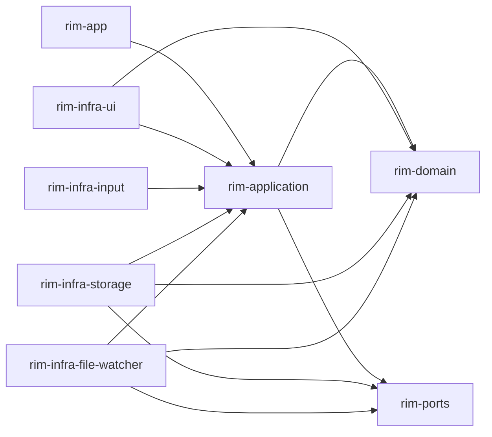
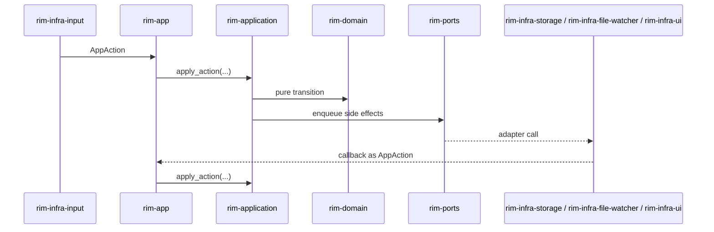

# Architecture

`rim` is organized as a layered, hexagonal Rust workspace. The repository is intentionally split so editor rules stay pure, use-case orchestration stays explicit, and runtime concerns stay at the edges.

## Workspace Map

- `rim-app`: composition root and runtime shell
- `rim-application`: use cases, action dispatch, workbench state, config application
- `rim-domain`: pure editor model and state transitions
- `rim-ports`: outbound trait contracts only
- `rim-infra-*`: adapters for UI, input, storage, and file watching

## Responsibilities

### `rim-domain`

Owns the editor aggregate and pure behavior:

- buffers, tabs, windows, cursor, selections, modes
- text editing and undo/redo transitions
- session snapshot and restore logic
- display-width and preview helpers that are editor-pure

`rim-domain` must not know about:

- status bar messages
- notifications
- picker state
- config files
- runtime services

### `rim-application`

Owns orchestration and workbench concerns:

- `AppAction` dispatch and use-case coordination
- command registry and command parsing
- workbench state such as overlays, picker state, notifications, status bar
- config loading and application
- save, reload, swap, and session workflows

`rim-application` may call domain methods and ports, but it should not re-implement pure editor transitions.

### `rim-ports`

Declares outbound interfaces:

- `StorageIo`
- `FileWatcher`
- `FilePicker`

No concrete implementation or runtime state belongs here.

### `rim-infra-*`

Implements ports and host-specific behavior:

- terminal rendering
- input event collection
- file watch integration
- persistence, swap, undo, and session storage

Adapters translate between host concerns and application/domain types. They must not own editor business rules.

### `rim-app`

Owns process bootstrap:

- startup wiring
- service startup and shutdown
- event bus loop
- terminal session lifetime
- adapter construction

`rim-app` should stay thin. If logic can run in a deterministic unit test without a terminal or filesystem, it likely belongs lower.

## Data Flow

## Dependency Rules

- `rim-domain` depends on no workspace crate.
- `rim-ports` depends on no workspace crate.
- `rim-application` may depend on `rim-domain`, `rim-ports`, and shared utility crates.
- `rim-infra-*` may depend on `rim-application`, `rim-domain`, and `rim-ports`.
- `rim-app` may depend on every concrete crate because it is the composition root.

## Placement Rules

Put new code in the highest layer that can own it correctly:

- Pure editor invariant or state transition: `rim-domain`
- Action orchestration or workbench state mutation: `rim-application`
- Trait contract for an external capability: `rim-ports`
- Terminal/filesystem/OS integration: `rim-infra-*`
- Wiring and lifecycle: `rim-app`

## Anti-Patterns

- Adding workbench fields to `EditorState`
- Returning terminal-specific data from `rim-domain`
- Calling infra crates directly from `rim-domain`
- Putting config parsing in `rim-app` when it is testable application behavior
