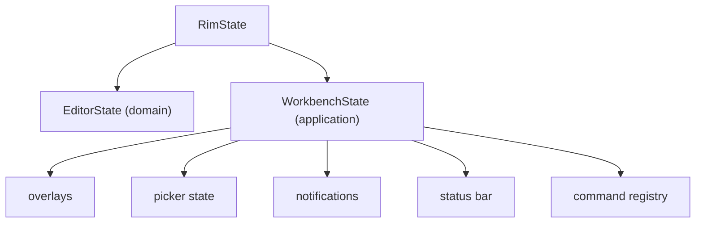

# Application Layer

`rim-application` sits between pure editor logic and runtime adapters.

## Responsibilities

- dispatch `AppAction`
- coordinate domain transitions and port calls
- own `WorkbenchState`
- manage config application
- handle save, reload, session, undo-history, and swap workflows
- translate domain outcomes into user-visible messages

## State Split

`RimState` is now an explicit aggregate:

- `editor: EditorState`
- `workbench: WorkbenchState`

`WorkbenchState` owns:

- overlays
- command line and palette state
- picker state and caches
- status bar
- notifications
- config-driven command registry
- pending save/reload/swap/session workflow flags

## How Use Cases Work

Typical application logic follows this pattern:

1. receive an `AppAction`
2. call a pure domain transition if needed
3. update workbench state
4. enqueue external work through a port
5. convert async callbacks back into `AppAction`

That shape is deliberate. It makes side effects visible without pushing them into the domain.

## What Should Stay Here

- command handling
- overlay/picker behavior
- config loading and reload responses
- status message policy
- swap and history orchestration
- file-open and workspace-file-preview flows

## What Should Move Down If Added Here By Accident

- buffer mutation rules
- cursor/selection math
- tab/window layout transitions that do not need viewport decisions
- session reconstruction logic

## Anti-Patterns

- duplicating domain transitions in action handlers
- storing business rules in notification logic
- letting workbench flags become a second editor model
