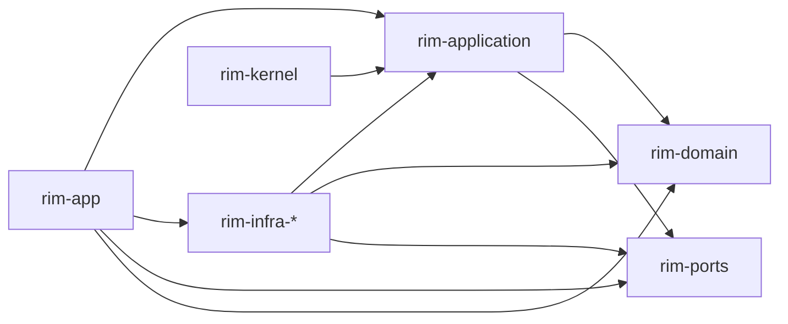

# Dependency Rules

These rules are the architectural contract for the workspace.

## Allowed Directions

## Disallowed Directions

- `rim-domain -> rim-application`
- `rim-domain -> rim-infra-*`
- `rim-domain -> rim-app`
- `rim-ports -> rim-domain` or any other workspace crate
- new real logic in `rim-kernel`

## Practical Rule Of Thumb

If a crate closer to the center needs something from an outer layer, introduce or refine a port instead of adding a direct dependency.

## Review Checklist

When reviewing a dependency change, ask:

1. Does this point inward toward more stable policy?
2. Does this move workbench state into the domain?
3. Is this only preserving compatibility through `rim-kernel`, or is it adding new ownership there?

If the answer to the second or third question is yes, the change is wrong.
