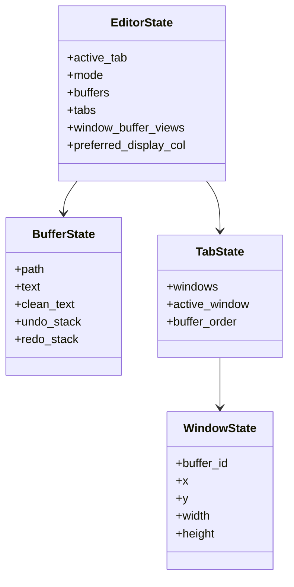

# Domain Model

`rim-domain` owns the editor as a pure state machine.

## Core Aggregate

The center of the domain is `EditorState`. It owns:

- buffers and their text/history
- tabs and windows
- active tab and active window routing
- cursor, selection, preferred column, and insert/visual state
- window-local buffer views

Workbench state is deliberately excluded.

## What Belongs Here

- cursor movement
- visual selection math
- text mutations
- undo/redo state transitions
- tab/window/buffer transitions that are editor-pure
- session snapshot and restore rules

## What Does Not Belong Here

- command palette state
- picker cache and loading state
- notifications
- status bar messaging
- config parsing or reload behavior
- filesystem watcher coordination

## Invariants

Important domain invariants include:

- the active tab must exist
- the active window must exist inside the active tab
- cursors and selections must be clamped to the active buffer text
- session restore must reject incompatible snapshots instead of partially restoring invalid state

## Persistence Compatibility

The domain owns snapshot shapes such as `WorkspaceSessionSnapshot` and persisted history structures. That keeps storage adapters from inventing their own editor model.

The storage format is still preserved for compatibility. The architecture change did not justify a persistence break.

## Anti-Patterns

- Passing `Terminal` or `Renderer` data into `rim-domain`
- Returning display messages instead of typed editor outcomes
- Storing config-derived registries in domain structs
