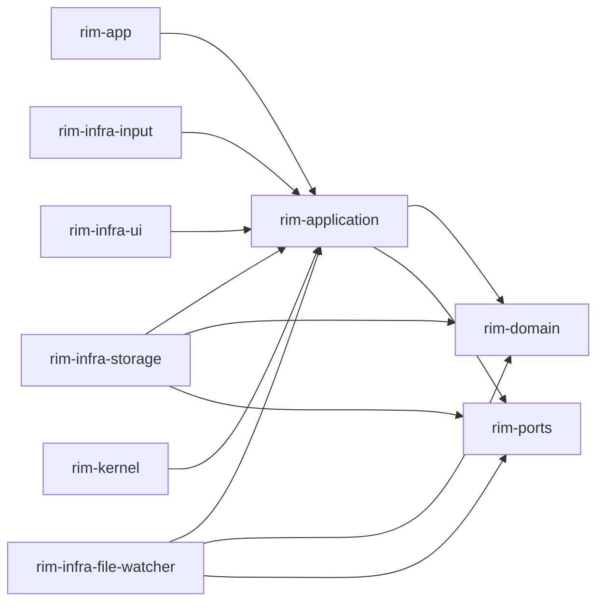
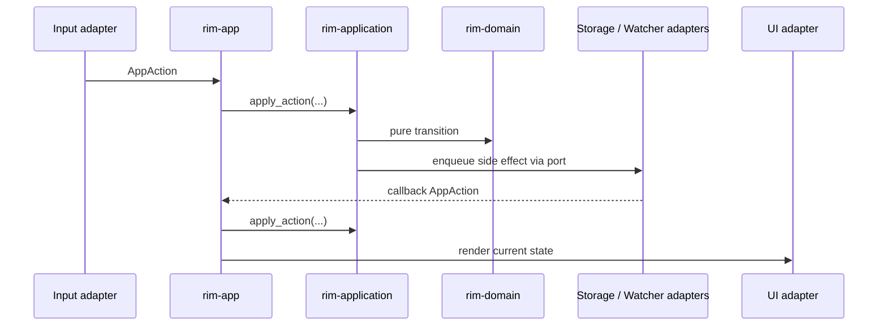

# Architecture Overview

`rim` is split into layers so editor rules remain deterministic and runtime behavior stays replaceable.

## Crate Map

## What Each Layer Owns

- `rim-domain`: editor state, editing rules, session reconstruction, pure helpers
- `rim-application`: actions, use cases, workbench state, config application, persistence orchestration
- `rim-ports`: trait contracts for external capabilities
- `rim-infra-*`: concrete adapters
- `rim-app`: composition root and runtime shell
- `rim-kernel`: compatibility facade only

## Why The Split Matters

This repository has two very different kinds of logic:

- logic that must be true for every editor state transition
- logic that coordinates terminals, filesystems, workers, and UI flows

Mixing them makes testing and maintenance harder. The current architecture keeps those concerns separate enough to reason about them independently.

## Data Flow At Runtime

## Placement Rule

When adding code, ask one question first: does this code still make sense without a terminal, filesystem, watcher, or config file?

- If yes, it probably belongs in `rim-domain`.
- If no, but it still belongs to editor use-case orchestration, it probably belongs in `rim-application`.
- If it talks to the outside world directly, it belongs in an adapter or `rim-app`.

## Anti-Patterns

- Adding overlays or status-bar fields to `EditorState`
- Letting adapters reach into domain internals instead of going through application flows
- Treating `rim-kernel` as a normal crate
