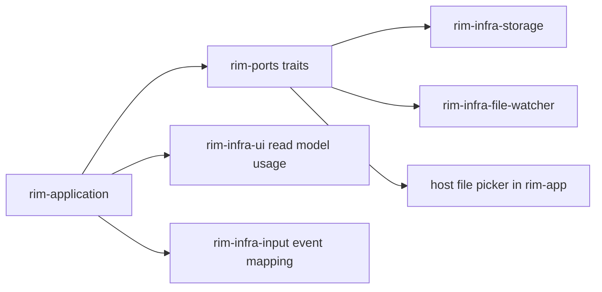

# Ports And Adapters

`rim` uses outbound ports so the application layer can request external work without owning concrete implementations.

## Ports

`rim-ports` currently defines:

- `StorageIo`
- `FileWatcher`
- `FilePicker`

These are trait contracts only. They describe what the application needs, not how the host provides it.

## Adapters

- `rim-infra-storage`: async file I/O, workspace file listing, previews, undo persistence, swap persistence, session persistence
- `rim-infra-file-watcher`: file and workspace watch integration
- `rim-infra-input`: terminal input capture and action emission
- `rim-infra-ui`: rendering and terminal session management

## Dependency Direction

Adapters may depend on application/domain types because they serialize or render those types. The reverse is not allowed.

Allowed:

- adapter implements a port
- adapter emits `AppAction`
- adapter serializes domain/application DTOs

Not allowed:

- domain calling adapter code directly
- adapter mutating editor state without an application action
- application depending on adapter-specific worker internals

## Why `SwapEditOp` Still Lives In Application

Swap replay is currently an application-facing integration contract used by storage orchestration. It is not editor domain state, so it should not be forced into `rim-domain`. It can remain in `rim-application` until a narrower shared contract emerges.

## Anti-Patterns

- adding filesystem semantics to `rim-ports`
- making UI rendering the source of truth for editor state
- hiding long-running worker behavior behind untyped callbacks
