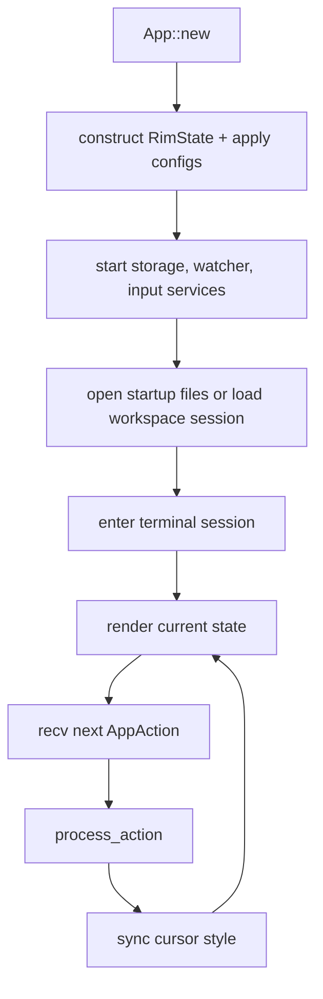

# Runtime Event Loop

`rim-app` is the runtime shell. It wires adapters together and drives the main action loop.

## Main Loop

## Runtime Responsibilities

- create the event bus
- initialize services
- enter and resume terminal mode
- dispatch actions into `rim-application`
- mark layout dirty when required
- host the file picker integration

## Why This Stays In `rim-app`

These concerns are runtime- and process-specific. They are not editor rules and are not use-case definitions by themselves.

## What Should Not Drift Back Into `rim-app`

- config parsing policy
- workbench state mutation logic
- editor state transitions
- persistence orchestration rules

If a block in `rim-app` becomes testable without terminal lifecycle state, it is probably in the wrong crate.
