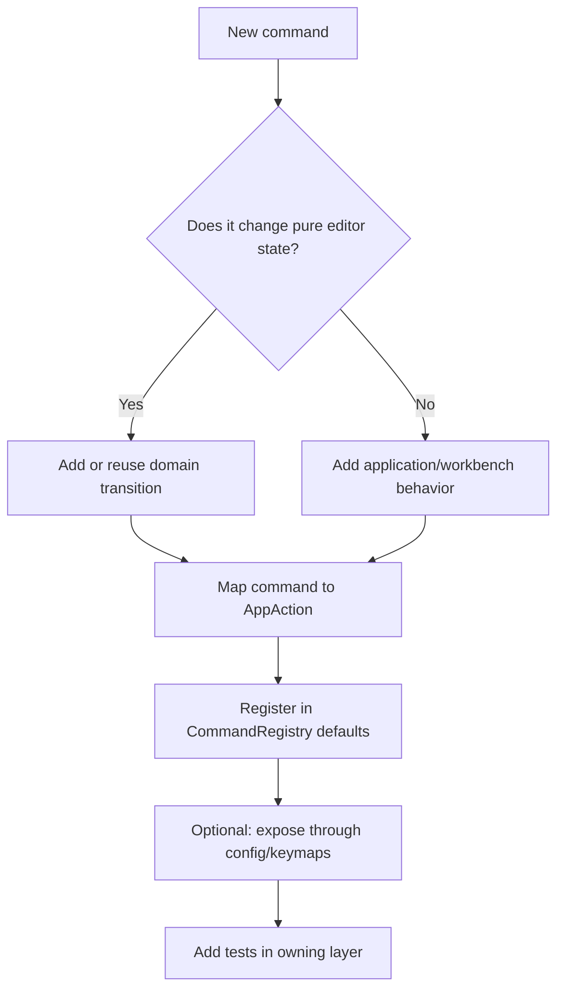

# How To Add A Command

Adding a command usually touches both the application layer and, if it changes editor state, the domain layer.

## Decision Tree

## Typical Steps

1. Add or reuse an `AppAction` in `rim-application/src/action.rs`.
2. If the command changes pure editor state, add the transition in `rim-domain`.
3. Handle the action in `rim-application/src/action_handler/`.
4. Register the command in `rim-application/src/command.rs`.
5. Add or update tests in the owning crate.

## Where Not To Put It

- not in `rim-kernel`
- not in `rim-app` unless it is runtime-only
- not in an adapter unless it is purely host-specific input mapping

## Config Exposure

If the command should be user-bindable:

- give it a stable command id in the registry
- ensure exported defaults include it
- confirm keymap/config load still works through `rim-application::config`
