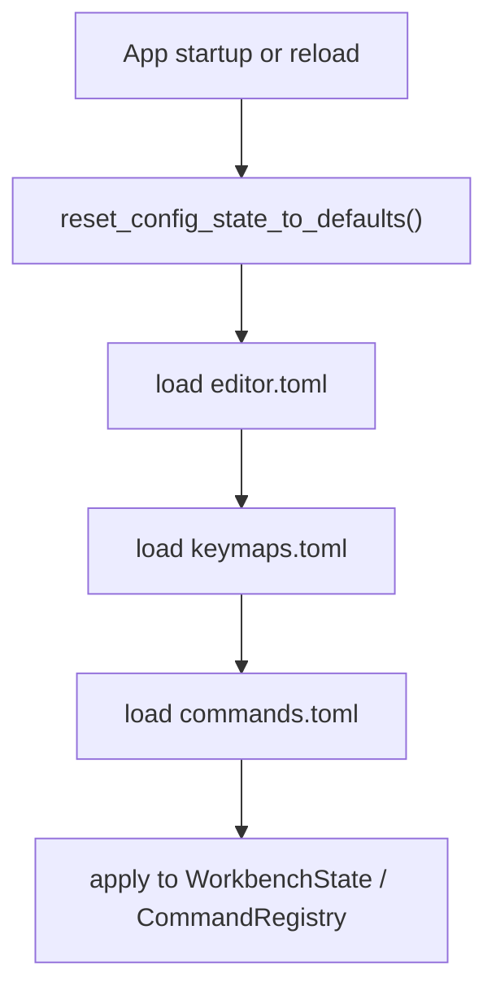

# Config

If you want to configure `rim` as a user, start with the user guide instead:

- [Configuration](/rim/guides/configuration/)

Configuration is owned by `rim-application`, not by `rim-app` and not by the domain.

## Files

The active config files are:

- `keymaps.toml`
- `commands.toml`
- `editor.toml`

They live under `rim_paths::user_config_root()`.

On Unix-like systems that is typically:

- `$XDG_CONFIG_HOME/rim`
- or `~/.config/rim`

## Load Flow

Missing files are not created at startup. If a config file is absent, `rim` keeps the embedded preset defaults for that slice.

## Ownership

- file paths and parsing policy: `rim-application::config`
- resulting command registry and workbench settings: `WorkbenchState`
- editor core: unaffected except through later actions

## Current Editor Settings

`editor.toml` currently controls:

- `leader_key`
- `cursor_scroll_threshold`
- `key_hints_width`
- `key_hints_max_height`

## Anti-Patterns

- putting config-derived registry state into `rim-domain`
- having adapters parse config on their own
- duplicating config path logic outside `rim-application`
- adding startup-time config file creation or migration side effects back into the runtime path
