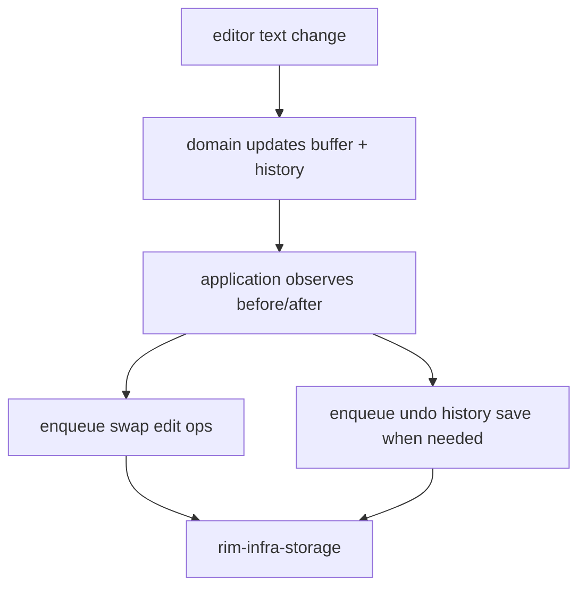

# Undo Redo Swap

Undo/redo and swap are related but separate concerns.

## Ownership Split

- undo/redo state transitions: `rim-domain`
- swap and history orchestration: `rim-application`
- on-disk persistence and recovery files: `rim-infra-storage`

## Storage Locations

Under `rim_paths::user_state_root()`:

- `undo/*.undo.log`
- `undo/*.undo.meta`
- `swp/*.swp`
- `session/last-session.json`

File names are derived from normalized source paths.

## Runtime Flow

## Recovery Semantics

- swap conflict detection is adapter-backed but application-driven
- user-visible recovery decisions remain in the application layer
- recovered text is restored before persisted undo history is reloaded

## Compatibility Constraint

Refactors must preserve current undo, redo, and swap formats unless the change is explicit, documented, and covered by migration logic or a compatibility story.

## Anti-Patterns

- storing swap semantics inside the domain
- making recovery policy a storage concern
- dropping undo stacks during architecture-only refactors
