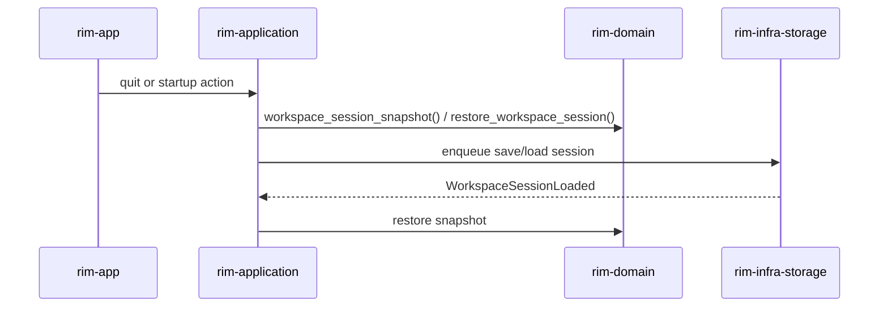

# Workspace Session

Workspace session persistence is split across layers:

- snapshot shape and reconstruction logic: `rim-domain`
- load/save orchestration: `rim-application`
- file I/O: `rim-infra-storage`

## File Location

The session file is stored as:

- `session/last-session.json` under `rim_paths::user_state_root()`

## Snapshot Shape

The session snapshot includes:

- buffers and their text
- clean text
- buffer ordering
- tabs and windows
- per-window view state
- scratch-buffer history when applicable

## Save And Restore Flow

## Compatibility

The current restore path still supports the legacy untitled-buffer history shape in old session files. That compatibility lives in the domain snapshot model and must be preserved unless a format migration is explicitly introduced.

## Anti-Patterns

- serializing ad hoc UI state into the session snapshot
- reconstructing editor state inside the storage adapter
- changing the snapshot format as an incidental refactor
